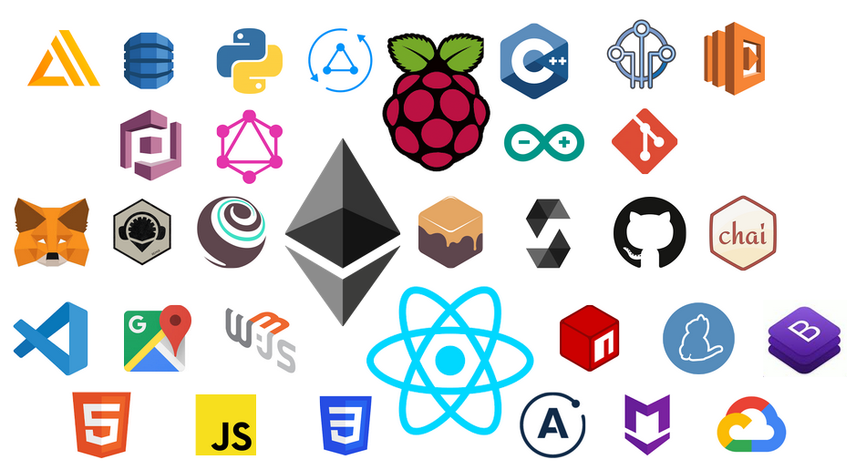

# Project Steps

1. git clone, etc..

# Contract Steps

1. `truffle compile` to compile contracts in this project
2. `truffle migrate`

# Front end Steps

1. `npm install`
2. `npm run start`

# Technologies used in this Project

1. Ethereum Blockchain
2. Ganache
3. Truffle
4. Solidity
5. AWS IoT
6. AWS AppSync
7. AWS Lambda
8. AWS DynamoDB
9. Google Cloud Platform - Maps
10. React
11. npm
12. yarn
13. Python
14. Raspberry Pi
15. Git
16. Github
17. Github Pages
18. MetaMask
19. GraphQL
20. AWS Cognito
21. Arduino
22. HTML5
23. CSS
24. JavaScript
25. Web3
26. Bootstrap
