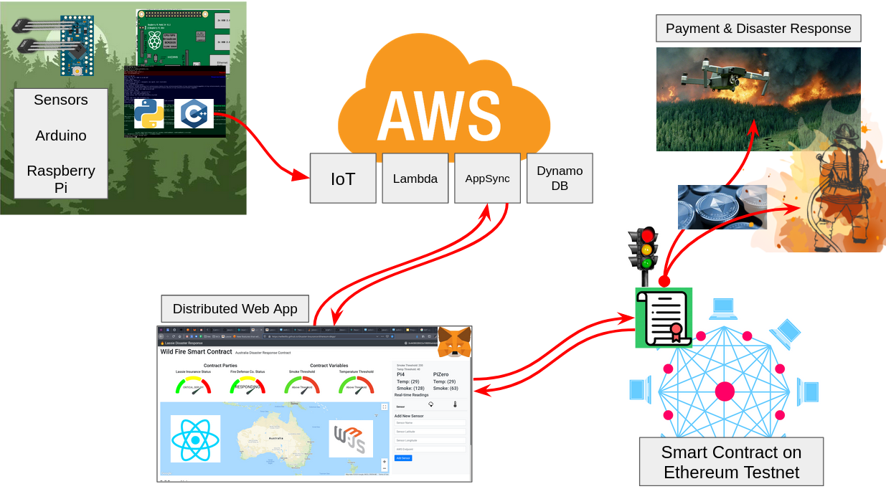

# Lassie Disaster Response with Internet of Things, Smart Contracts and flying things...

Our process starts with Arduino Sensors connected to a Rasberry Pi. Python and C++
programs on the Pi send real-time sensor data to AWS Cloud services. From there, the
React DApp subscribes to that data, in near real-time. If SMOKE and TEMPERATURE levels
breach the threshold defined for this specifc geographical area and Smart Contract,
Ethereum will be deployed to the Disaster Response teams to rememediate the natural disaster.

# Install Steps

1. `git clone git@github.com:willwillis/Disaster-Insurance-Ethereum-dApp.git`
2. `cd Disaster-Insurance-Ethereum-dApp`

# Compile Solidity Smart Contract

1. `truffle compile` compile all .sol contracts in this folder structure
2. `truffle migrate` Deploys to the network
3. `truffle build` Builds everything to the front-end folder
4. Fund the contract (currently <> with some wei)

# Install node dependencies for the React front-end

1. `npm install` pulls down dependent javascript libraries
2. `npm run start` starts local server

# Build Project and Deploy to Github Pages

1. `npm run build` builds a deployable release of the DAapp
2. `npm run deploy` given our conig, this deploys to github pages

# Technologies used in this Project

1. Ethereum Blockchain
2. Ganache
3. Truffle
4. Solidity
5. AWS IoT
6. AWS AppSync
7. AWS Lambda
8. AWS DynamoDB
9. Google Cloud Platform - Maps
10. React
11. npm
12. yarn
13. Python
14. Raspberry Pi
15. Git
16. Github
17. Github Pages
18. MetaMask
19. GraphQL
20. AWS Cognito
21. Arduino
22. HTML5
23. CSS
24. JavaScript
25. Web3
26. Bootstrap
